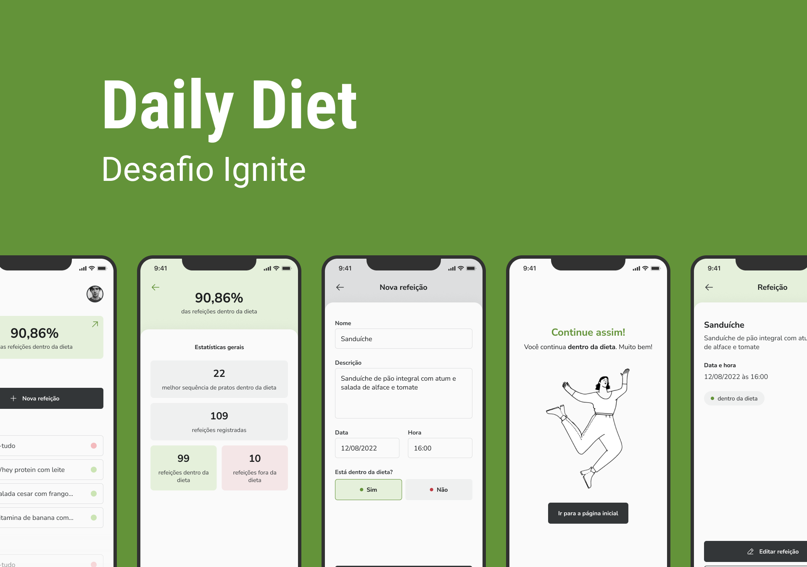

<h1 align="center">
  Daily Diet
</h1>

<p align="center">
  

  

  

  

</p>

<br/>



## 💻 Project

This project aims to control diet habits. User can add, edit and delete meals.

## 🚀 Technologies

This project was developed with the main following technologies:

- [React Native](https://reactnative.dev)
- [TypeScript](https://www.typescriptlang.org/)
- [Styled Components](https://styled-components.com/)

## 🔖 Layout

You can view the layout of the project in the [mobile](https://www.figma.com/file/I068xsxgejJQNJwM68pQGo/Daily-Diet-(Copy)?t=2bt1gDKvLWyErVdT-0) version.

## ℹ️ How To Use

To clone and run this application, you'll need [git](https://git-scm.com), [yarn](https://legacy.yarnpkg.com), [node](https://nodejs.org/en/). From your command line:

```bash
# Clone the repository
$ git clone https://github.com/leondavidtb/dailydiet.git
```

### 📱 Mobile

```bash
# Go into the repository
$ cd dailydiet
# Install dependencies
$ npm install
# Run the development server
$ expo start
# The app will automatically starts Metro Bundler. You may use an emulator or your own smartphone.
# The app will automatically reload if you change any of the source files.
```

---

<p align="center">Made with ☕ by Leonardo David 👋🏻 <a href="https://www.linkedin.com/in/leondavidtb/">Get in touch!</a></p>
